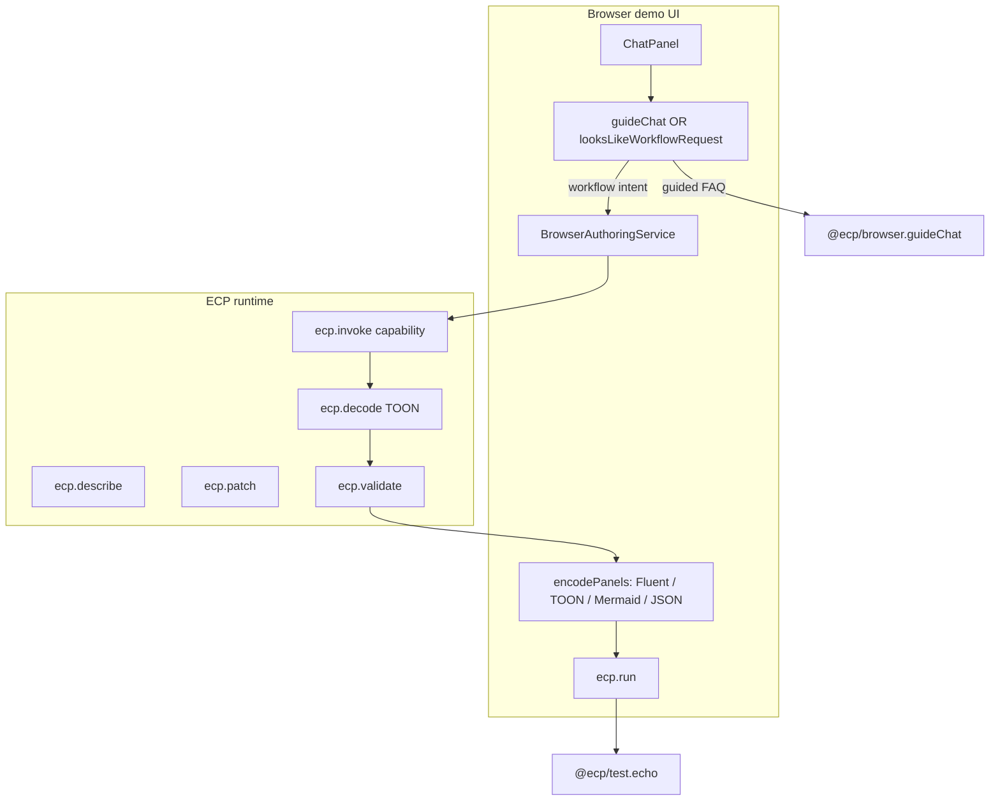

# Browser demo: extensions, capabilities, prompts, and intent routing

This report describes what exists in the **ECP browser demo** today: which extensions are registered, how capabilities are invoked, what system and user prompts are passed to each model path, and how chat intent is filtered before authoring runs. Use it to reason about next steps—especially **intent classification** for workflow authoring vs general Q&A on Chrome Gemini Nano and other providers.

**Scope:** `apps/browser-demo`, `packages/runtimes/browser`, and extensions bound by `createBrowserDemoEnvironment()` / `createDemoAppEnvironment()`. Other packages in the monorepo (Ollama, Slack, storage, etc.) exist but are **not** wired into the browser demo environment unless noted.

---

## 1. Architecture at a glance

The demo app is not “a model with a UI.” It is an **ECP environment** (`browser-demo-app`) with bound extensions, plus a thin React shell that:

1. Calls **`ecp.describe()`** to learn bound extensions and capabilities.
2. Routes chat through either **guided help** or **workflow authoring** (model-generated TOON).
3. Uses the **canonical workflow manifest** (JSON-shaped `@ecp.workflow`) as the hub for Fluent, TOON, and Mermaid panels.
4. Runs workflows via **`ecp.run(manifest)`**, which invokes step capabilities (e.g. `@ecp/test.echo`).



**Key separation:**

| Concern | Mechanism | Output |
| -------- | ----------- | -------- |
| “Explain ECP / UI” | `@ecp/browser.guideChat` or Nano with future general prompt | Prose in chat |
| “Create / change workflow” | `BrowserAuthoringService` → `*.generateText` | TOON → manifest → panels |
| “Run workflow” | `ecp.run` | Step capability results (JSON in Run panel) |
| “Show graph / code” | `encodePanels` from manifest | Independent encoders (no TOON→Mermaid pipeline) |

---

## 2. Environment: what is bound for the demo

### 2.1 Registration (`registerBrowserDefaults`)

All of the following are registered on the global extension catalog when the browser package loads defaults:

| Extension ID | Package | Role in demo |
| ------------ | ------- | ------------ |
| `@ecp/browser` (runtime) | `packages/runtimes/browser` | Browser execution runtime |
| `@ecp/browser-registry` | `packages/runtimes/browser` | Registry freeze, `globalThis.ecp`, auto-bind |
| `@ecp/browser-session-config` | `packages/runtimes/browser` | In-memory session keys (API keys); cleared on `terminate()` |
| `@ecp/browser-local-config` | `packages/runtimes/browser` | Optional localStorage config (denylist for secrets) |
| `@ecp/browser` | `packages/runtimes/browser` | **`guideChat`** onboarding capability |
| `@ecp/format-toon` | `packages/extensions/format-toon` | Encode/decode TOON |
| `@ecp/format-mermaid` | `packages/extensions/format-mermaid` | Manifest → Mermaid source |
| `@ecp/demo` | `packages/extensions/demo` | Offline **`generateText`** stub |
| `@ecp/chrome-ai` | `packages/extensions/chrome-ai` | Chrome **`LanguageModel`** provider |
| `@ecp/openai` | `packages/extensions/openai` | OpenAI Chat Completions |
| `@ecp/claude` | `packages/extensions/claude` | Anthropic Messages API |
| `@ecp/policies` (standard) | `packages/policies` | Including `@ecp/registry-control` |

Source: [`packages/runtimes/browser/src/environment.ts`](../packages/runtimes/browser/src/environment.ts).

### 2.2 Demo app environment manifest

`createDemoAppEnvironment()` builds:

- Base: `createBrowserDemoEnvironment("browser-demo-app")` (extensions above).
- **Extra bind:** `extension("@ecp/test").with({})` so `@ecp/test.echo` appears in `describe()` and validates for workflow steps.
- **`registerTestExtension()`** registers `@ecp/test` on the registry (not in the default browser env list, but allowed by policy and bound at app init).

Source: [`apps/browser-demo/src/lib/demo-environment.ts`](../apps/browser-demo/src/lib/demo-environment.ts).

### 2.3 Policy

`@ecp/registry-control` allows namespaces: `@ecp/demo`, `@ecp/chrome-ai`, `@ecp/openai`, `@ecp/claude`, `@ecp/browser`, `@customer/*`, `@ecp/test`.

---

## 3. Capabilities reference (browser demo)

### 3.1 Model providers (`generateText`)

Used **only** through `BrowserAuthoringService` for create/patch (except demo is also used in guided workflow path). Shared input shape from authoring:

```ts
{
  prompt: string,   // multi-line user + context (see section 4)
  system?: string // instruction line (provider support varies)
}
```

| Capability | Provider | Bound in env | `system` honored? | Notes |
| ---------- | -------- | ------------ | ----------------- | ----- |
| `@ecp/chrome-ai.generateText` | Chrome `LanguageModel` | Yes | **Yes** → `systemPrompt` on `create()` | Throws if model not `available` |
| `@ecp/demo.generateText` | Deterministic stub | Yes | **No** (ignored) | Pattern-matches `prompt` string |
| `@ecp/openai.generateText` | OpenAI API | Yes (needs key) | **No** | Only `prompt` sent as user message |
| `@ecp/claude.generateText` | Anthropic API | Yes (needs key) | **Yes** | `system` + user `prompt` |

**UI mapping** ([`provider-mode.ts`](../apps/browser-demo/src/lib/provider-mode.ts)):

| `ProviderMode` | Capability invoked |
| -------------- | -------------------- |
| `chrome-ai` | `@ecp/chrome-ai.generateText` |
| `demo` | `@ecp/demo.generateText` |
| `openai` | `@ecp/openai.generateText` |
| `claude` | `@ecp/claude.generateText` |

OpenAI extension also exposes `@ecp/openai.generate`, `@ecp/openai.evaluate`—not used by the browser demo chat/authoring path today.

### 3.2 Chrome AI install / availability

| Capability | Purpose |
| ---------- | ------- |
| `@ecp/chrome-ai.checkAvailability` | Returns `{ available, supported, status }` (unsupported, unavailable, downloadable, downloading, available) |
| `@ecp/chrome-ai.startModelDownload` | Triggers `LanguageModel.create({ monitor })`; download progress via `downloadprogress` events |
| `@ecp/chrome-ai.getModelInstallState` | Pollable `{ phase, loaded?, total?, error? }` for UI |

Implementation: [`packages/extensions/chrome-ai/src/model-install.ts`](../packages/extensions/chrome-ai/src/model-install.ts).

### 3.3 Guided onboarding (no model)

| Capability | Input | Output | Model |
| ---------- | ----- | ------ | ----- |
| `@ecp/browser.guideChat` | `{ message: string }` | `{ text: string }` | Keyword templates (no LLM) |

### 3.4 Format / encoding (no LLM)

| Capability / API | Direction | Used for |
| ---------------- | --------- | -------- |
| `@ecp/format-toon` encode/decode | Manifest ↔ TOON | Authoring pipeline, panels |
| `@ecp/format-mermaid` encode | Manifest → Mermaid | Graph tab (`direction: "LR"`) |
| `ecp.encode(manifest).as("fluent")` | Manifest → Fluent TS | Code sidebar (browser import) |
| `ecp.validate(manifest)` | Structural + binding checks | Validation overlay |
| `ecp.patch(manifest)` | Apply `@ecp.patch` TOON | Patch path after model returns patch TOON |

### 3.5 Workflow execution

| Capability | Input | Output |
| ---------- | ----- | ------ |
| `@ecp/test.echo` | `{ value?: unknown }` | `{ echo: unknown }` |

Registered via `@ecp/core` testing extension; bound in demo app environment. Demo-generated workflows reference `@ecp/test.echo` on the echo step.

---

## 4. System and user prompts (authoring path)

All workflow creation and patching goes through [`BrowserAuthoringService`](../packages/runtimes/browser/src/authoring/browser-authoring-service.ts). The service **always**:

1. Calls `ecp.describe()` and encodes the descriptor to compact TOON.
2. Invokes the selected `*.generateText` with a constructed **prompt** and **system** string.
3. Decodes returned text as TOON → `@ecp.workflow` or `@ecp.patch`.
4. Validates and encodes panels.

### 4.1 Create workflow

**System prompt (fixed):**

```text
Return only ECP TOON workflow text. No markdown fences.
```

**User prompt (assembled):**

```text
Return only a compact TOON @ecp.workflow document for this request.
User request: <user chat text>
Environment descriptor (TOON):
<compact describe() TOON>
```

**Post-processing:** `ecp.decode(text).uses("@ecp/format-toon").to("@ecp.workflow")` → `validate` → `encodePanels`.

### 4.2 Patch workflow

**System prompt (fixed):**

```text
Return only ECP TOON patch document. No markdown fences.
```

**User prompt (assembled):**

```text
Return only compact TOON for schema @ecp.patch.
User request: <user chat text>
Environment descriptor (TOON):
<descriptor TOON>
Current workflow (TOON):
<current workflow TOON>
```

**Post-processing:** decode to `@ecp.patch` → `ecp.patch(manifest)` → validate → encode panels (patch TOON kept in Patch tab).

### 4.3 What each provider actually receives

| Provider | System | User content |
| -------- | ------ | ------------ |
| **Chrome AI** | Passed as `systemPrompt` on session | Full assembled **prompt** string as single user turn |
| **Claude** | Anthropic `system` parameter | `prompt` as user message |
| **OpenAI** | *Dropped* — not in `GenerateInput` | Entire assembled string as user message only |
| **Demo** | Ignored | Inspects `prompt` for `@ecp.patch` / `schema @ecp.patch` vs default workflow template |

**Implication for Chrome Nano:** The model sees one combined user blob plus a short system line demanding raw TOON. Nano must follow strict format constraints while also reading environment + workflow context in the user block. There is **no** separate “chat personality” system prompt on the authoring path.

**Implication for evaluation:** Compare providers on identical `BrowserAuthoringService` prompts; fix OpenAI to forward `system` if parity matters.

---

## 5. Chat intent routing (current “intent filters”)

Intent is **not** implemented inside model providers. It lives in the **demo app** in two layers.

### 5.1 Assistant mode

| Mode | When | Chat behavior |
| ---- | ---- | ------------- |
| `guided` | Explore-first or Chrome install in background | FAQ unless workflow keywords match |
| `authoring` | Provider selected or after workflow-like guided message | Always `BrowserAuthoringService` |

State: `assistantMode` in [`App.tsx`](../apps/browser-demo/src/App.tsx).

### 5.2 `looksLikeWorkflowRequest` (keyword router)

Source: [`apps/browser-demo/src/lib/chat-routing.ts`](../apps/browser-demo/src/lib/chat-routing.ts).

**Treat as workflow authoring if:**

- Contains `patch`, `update workflow`, or `change workflow`, **or**
- Contains (`create` \| `build` \| `generate` \| `add step`) **and** (`workflow` \| `echo` \| `step`).

**Otherwise in guided mode:** invoke `@ecp/browser.guideChat` (templates, no LLM).

**Otherwise in authoring mode:** always authoring (create or patch via `BrowserAuthoringService`).

**Provider used for authoring:**

```ts
const cap =
  assistantMode === "guided"
    ? providerCapabilityId("demo")      // always demo in guided
    : providerCapabilityId(providerMode) // chrome-ai | openai | claude | demo
```

After a successful workflow-like message in guided mode, UI switches to `authoring`.

### 5.3 Gaps vs desired “intent filters”

| Gap | Risk |
| --- | ---- |
| Keyword-only routing | “Make an echo flow” may miss; “tell me about create workflows” may false-positive |
| No LLM intent classifier | Nano never used for “explain validation” in authoring mode—gets full TOON prompt |
| Guided path never uses Chrome | Even after Nano is ready, user may stay on demo until they select chrome-ai in settings |
| `guideChat` duplicates keyword logic | Overlap with `looksLikeWorkflowRequest` for “create workflow” phrasing |
| Authoring always TOON-shaped prompts | General questions in authoring mode hit wrong task template |
| OpenAI ignores `system` | Weaker format adherence vs Claude/Chrome |

---

## 6. Chrome Gemini Nano: install UX vs chat behavior

### 6.1 Install flow (implemented)

1. First-run: user can pick Chrome AI, explore with guided mode, or install with dialog/toast.
2. `startModelDownload` → `LanguageModel.create({ monitor })` with progress polling.
3. On ready: `providerMode = chrome-ai`, `assistantMode = authoring`, ECP `terminate` + recreate environment, **preserve** manifest/panels/chat.

### 6.2 Nano for “basic queries”

Today Nano is **only** invoked when:

- `assistantMode === "authoring"` **and** `looksLikeWorkflowRequest` is true (guided uses demo), **or**
- User is in authoring mode and sends any message (always authoring—not just workflow intent).

There is **no** path that sends a short general system prompt to Nano for Q&A. Options for ideation:

| Approach | Description |
| -------- | ----------- |
| **A. Three-way router** | `general` → Nano/Claude with chat system prompt; `workflow` → `BrowserAuthoringService`; `help` → `guideChat` |
| **B. Nano chat + service split** | New `BrowserChatService` with `{ message }` and a general ECP assistant system prompt |
| **C. Classifier capability** | Small `*.classifyIntent` using Nano with JSON schema (workflow, faq, other) |
| **D. Unified prompt with tool-style output** | Single Nano call—fragile for TOON vs prose |

Recommendation: **A + C** — explicit intent enum; only workflow intents get TOON system prompts and descriptor/workflow context.

---

## 7. Demo provider behavior (offline reference)

[`@ecp/demo.generateText`](../packages/extensions/demo/src/index.ts) ignores `system`. It returns:

- **Default:** fixed `@ecp.workflow` TOON with one step `echo` → `@ecp/test.echo`.
- **If prompt contains** `@ecp.patch` or `schema @ecp.patch`: fixed patch TOON patching `steps[echo].input`.

Useful for UI tests without API keys or Chrome; **not** representative of real model quality.

---

## 8. Panel encoding hub (reasoning about extensions)

From `encodePanels` ([`browser-authoring-service.ts`](../packages/runtimes/browser/src/authoring/browser-authoring-service.ts)):

```text
WorkflowManifest (canonical JSON hub)
  ├─ ecp.encode().as("fluent")     → Code sidebar (Workflow tab)
  ├─ ecp.encode().uses("@ecp/format-toon") → TOON tab
  ├─ ecp.encode().uses("@ecp/format-mermaid").with({ direction: "LR" }) → Graph
  └─ JSON.stringify(canonical)     → JSON tab
```

Fluent edits compile in the browser (`compileWorkflowSource`) and re-enter the same hub—no parallel pipeline.

---

## 9. How to reason about extension + model combinations

| Goal | Use | Avoid |
| ---- | --- | ----- |
| Teach UI / ECP concepts offline | `guideChat` or future Nano general prompt | `BrowserAuthoringService` |
| Generate/edit workflow | `BrowserAuthoringService` + chosen `*.generateText` | Raw `invoke(generateText)` without TOON decode/validate |
| Reliable CI / no keys | `demo` provider | chrome-ai / openai / claude |
| On-device privacy | `chrome-ai` after install | Sending descriptor TOON to cloud |
| Best TOON adherence | Claude or Chrome (system honored) | OpenAI until `system` forwarded |
| Run steps | `ecp.run` + manifest with valid `uses` | Invoking echo directly from chat |
| See bound capabilities | `ecp.describe()` / Environment code tab | Hard-coding capability lists in UI |

**Descriptor in every authoring prompt:** The environment TOON tells the model which capabilities exist (from bindings). If you add extensions, **re-describe** or regenerate after bind changes so prompts stay accurate.

---

## 10. Related plans and docs

| Document | Content |
| -------- | ------- |
| [`docs/ecp-browser-demo.md`](ecp-browser-demo.md) | Phased plan: UI, providers, Chrome extension |
| Chrome install UX plan | Guided onboarding, install dialog/toast (implemented) |
| Solaris Slate UI plan | Layout, theme (implemented) |
| [`apps/browser-demo/README.md`](../apps/browser-demo/README.md) | Dev commands, panel encoding note |

---

## 11. Suggested next steps (intent + prompts)

1. **Introduce `Intent` enum** — `faq` \| `workflow-create` \| `workflow-patch` \| `general` (and maybe `run`).
2. **Classifier** — Keywords first; optional Nano call with tiny JSON-only system prompt when keywords ambiguous.
3. **Split prompts** — `AuthoringPrompts` module: TOON system/user templates only for workflow intents; `ChatPrompts` for Nano/Claude general Q&A with short ECP context (no full descriptor unless user asks environment questions).
4. **Align OpenAI** — Add `system?: string` to `@ecp/openai.generateText` and pass it through to Chat Completions API.
5. **Chrome general chat** — After install, route `faq`/`general` to Nano with non-TOON system message; keep authoring on strict TOON system.
6. **Telemetry** — Log intent, provider, and decode/validation success to compare Nano vs cloud on workflow tasks.
7. **Tests** — Golden files for prompt assembly; table-driven intent routing cases.

---

## 12. Quick reference: invoke paths from UI

| User action | Code path | Capability / API |
| ----------- | --------- | ---------------- |
| Chat (guided, FAQ) | `App.onSubmit` → | `@ecp/browser.guideChat` |
| Chat (workflow) | `BrowserAuthoringService` → | `*.generateText` |
| Execute | `ecp.run(manifest)` | Step `uses` e.g. `@ecp/test.echo` |
| Edit Fluent | `compileWorkflowSource` → `applyPanels` | validate + encode |
| Settings / first run | Provider modal | chrome install capabilities |
| Refresh capabilities view | `describe()` | (descriptor only) |

---

*Generated from the codebase state after Chrome install UX and Solaris Slate UI implementation. For exact line-level behavior, follow links to source files above.*
