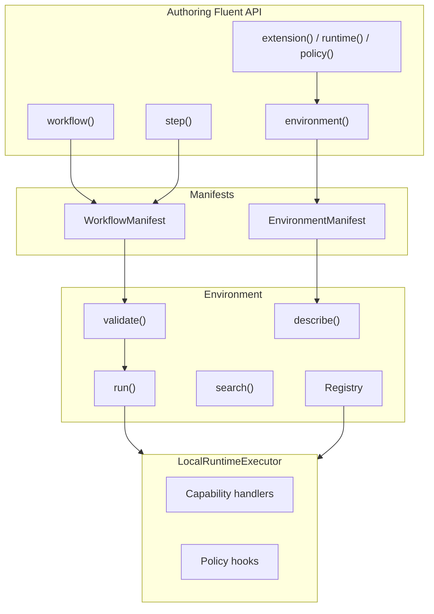

# ECP Overhaul — Implementation Report

This document records what was built in the `@executioncontrolprotocol/*` monorepo against [ecp-overhaul.md](../ecp-overhaul.md) (v1.0). It includes a **complete Fluent API reference**: every core builder class, runtime object, and public function with signatures and behavior.

**Last aligned with:** `@executioncontrolprotocol/cli` Oclif migration (five commands: `compile`, `validate`, `describe`, `search`, `run`).

---

## Table of contents

1. [Executive summary](#1-executive-summary)
2. [Fluent API — complete reference](#2-fluent-api--complete-reference)
3. [Package inventory](#3-package-inventory)
4. [`@executioncontrolprotocol/types` — protocol types](#4-executioncontrolprotocoltypes--protocol-types)
5. [`@executioncontrolprotocol/core` — non-fluent modules](#5-executioncontrolprotocolcore--non-fluent-modules)
6. [Extensions, policies, MCP, CLI](#6-extensions-policies-mcp-cli)
7. [Examples, tests, gaps](#7-examples-tests-gaps)
8. [Architecture diagram](#8-architecture-diagram)

---

## 1. Executive summary

| Layer | Status | Package / path |
| ----- | ------ | -------------- |
| Definitions | Done | `@executioncontrolprotocol/core` — `defineExtension`, `defineRuntime`, `definePolicy`, `capability`, `hook` |
| Bindings (authoring) | Done | `workflow`, `step`, `extension`, `runtime`, `policy` |
| Value helpers | Done | `ref`, `state`, `env`, `expr` |
| Flow control | Done | `parallel`, `branch`, `loop` |
| Environment | Done | `Environment`, `environment()` |
| Workflow manifests | Done | Portable `@executioncontrolprotocol.workflow` JSON |
| Local execution | Done | `@executioncontrolprotocol/local` / `LocalRuntimeExecutor` |
| Compile TS/JS | Done | `compileWorkflowSource`, esbuild |
| Describe / search | Done (basic) | Environment catalog + substring search |
| MCP adapter | Package only | `@executioncontrolprotocol/mcp` — not on CLI |
| CLI | Partial vs spec §14 | Oclif; no `mcp serve`, no `config` |
| Legacy v0.5 | Archived | `archive/legacy-v0.5/` |

**Rule:** Workflow manifests do not contain runtime config, extension config, policies, or secrets. Environments execute workflows.

---

## 2. Fluent API — complete reference

All symbols below are exported from `@executioncontrolprotocol/core` unless noted. Browser entry [`packages/core/src/browser.ts`](../packages/core/src/browser.ts) exports a subset (no `Environment`, `Registry`, loaders, or `environment()`).

### 2.1 Module-level factory functions

| Function | Returns | Description |
| -------- | ------- | ----------- |
| `workflow(label: string)` | `WorkflowBuilder` | Start a workflow definition. |
| `step(ref: CapabilityId \| string, label?: string)` | `StepBuilder` | Define a step invoking a capability. |
| `extension(ref: NamespacedId \| ExtensionDefinition \| string, label?: string)` | `ExtensionBindingBuilder` | Bind an extension in an environment. |
| `runtime(ref: NamespacedId \| RuntimeDefinition \| string, label?: string)` | `RuntimeBindingBuilder` | Bind a runtime in an environment. |
| `policy(ref: NamespacedId \| PolicyDefinition \| string, label?: string)` | `PolicyBindingBuilder` | Bind a policy in an environment. |
| `environment(id: string, label?: string)` | `Environment` | Create an environment (defaults to `@executioncontrolprotocol/local`). |
| `defineExtension(namespace: string, name: string)` | `ExtensionDefinitionBuilder` | Register-time extension definition. |
| `defineRuntime(namespace: string, name: string)` | `RuntimeDefinitionBuilder` | Register-time runtime definition. |
| `definePolicy(namespace: string, name: string)` | `PolicyDefinitionBuilder` | Register-time policy definition. |
| `capability(name: string)` | `CapabilityBuilder` | Capability builder (placeholder extension id; prefer `capabilityFor`). |
| `capabilityFor(extensionId: NamespacedId, name: string)` | `CapabilityBuilder` | Capability builder scoped to an extension. |
| `hook(event: LifecycleEvent, handler: HookHandler, options?)` | `HookDefinition` | Single lifecycle hook definition. |
| `parallel(branches: NodeInput[][], options?)` | `ParallelNode` | Parallel flow manifest node. |
| `branch(steps: Array<StepBuilder & { when?: ExprValue }>, options?)` | `BranchNode` | Conditional branch node. |
| `loop(options: LoopOptions, steps: NodeInput[])` | `LoopNode` | Loop flow manifest node. |
| `ref(path: string, options?: RefOptions)` | `RefValue` | Read-only reference to committed state (`state.*`). |
| `state<T>(path: string, options?: StateOptions)` | `StoreStateHandle<T> & StateValue` | Mutable state handle for workflows / store. |
| `env(name: string, options?: EnvOptions)` | `EnvValue` | Reference to environment config key (`$env`). |
| `registerTestExtension()` | `void` | Register `@executioncontrolprotocol/test` + `@executioncontrolprotocol/test.echo` on `globalRegistry`. |
| `registerLocalRuntime()` | `void` | Register `@executioncontrolprotocol/local` on `globalRegistry`. |

`NodeInput` = `StepBuilder | WorkflowNode`.

### 2.2 `WorkflowBuilder`

**Source:** [`packages/core/src/workflow/builder.ts`](../packages/core/src/workflow/builder.ts)

| Member | Signature | Returns | Description |
| ------ | --------- | ------- | ----------- |
| `constructor` | `(label: string)` | — | Internal; use `workflow(label)`. |
| `run` | `(nodes: NodeInput[])` | `this` | Append sequential steps or flow nodes. |
| `id` | `(id: string)` | `this` | Override workflow id in manifest (default: slug of label). |
| `compile` | `()` | `WorkflowManifest` | Alias for `toManifest()`. |
| `toManifest` | `()` | `WorkflowManifest` | Build `@executioncontrolprotocol.workflow` document (no validation). |
| `validate` | `(descriptor?: EnvironmentDescriptor)` | `ValidationResult` | Validate manifest; optional environment descriptor. |
| `toGraph` | `()` | `{ nodes: WorkflowNode[]; label: string }` | Lightweight graph view for visualization. |

### 2.3 `StepBuilder`

**Source:** [`packages/core/src/bindings/step.ts`](../packages/core/src/bindings/step.ts)

| Member | Signature | Returns | Description |
| ------ | --------- | ------- | ----------- |
| `constructor` | `(uses: CapabilityId \| string, label?: string)` | — | Internal; use `step(uses, label?)`. |
| `uses` | (readonly property) | `CapabilityId \| string` | Capability id for this step. |
| `label` | (readonly property) | `string \| undefined` | Human-readable step label. |
| `with` | `(input: Record<string, InputValue>)` | `this` | Merge step input (refs, literals, expr). |
| `when` | `(condition: ExprValue)` | `this` | Run step only when condition holds. |
| `as` | `(key: string, options?: AsOptions)` | `this` | Commit output to `state[key]`. |
| `id` | `(id: string)` | `this` | Override step id (default: slug of label or uses). |
| `toNode` | `()` | `StepNode` | Serialize to manifest `StepNode`. |

**`AsOptions`**

| Field | Type | Description |
| ----- | ---- | ----------- |
| `mode` | `CommitMode` | Optional commit mode: `create`, `replace`, `merge`, `append`, `version`. |

### 2.4 Flow helpers

**Source:** [`packages/core/src/workflow/flow.ts`](../packages/core/src/workflow/flow.ts)

**`parallel(branches, options?)`**

| Parameter | Type | Description |
| --------- | ---- | ----------- |
| `branches` | `NodeInput[][]` | Array of parallel branch step lists. |
| `options.id` | `string` | Node id (default `parallel-1`). |
| `options.label` | `string` | Optional label. |

**`branch(steps, options?)`**

| Parameter | Type | Description |
| --------- | ---- | ----------- |
| `steps` | `Array<StepBuilder & { when?: ExprValue }>` | Each branch arm (one step per arm in v1). |
| `options.id` | `string` | Node id (default `branch-1`). |
| `options.label` | `string` | Optional label. |

**`loop(options, steps)`**

**`LoopOptions`**

| Field | Type | Description |
| ----- | ---- | ----------- |
| `label` | `string` | Loop label. |
| `until` | `ExprValue` | Exit condition. |
| `maxRounds` | `number` | Max iterations. |
| `id` | `string` | Node id (default slug of label or `loop`). |

### 2.5 Value helpers

**`ref(path, options?)`** — [`helpers/ref.ts`](../packages/core/src/helpers/ref.ts)

| `RefOptions` field | Type | Description |
| ------------------ | ---- | ----------- |
| `optional` | `boolean` | Mark ref optional. |
| `fallback` | `unknown` | Fallback if missing. |

Normalizes path to `state.<path>` unless already prefixed.

**`state(path, options?)`** — [`helpers/state.ts`](../packages/core/src/helpers/state.ts)

| `StateOptions` field | Type | Description |
| -------------------- | ---- | ----------- |
| `optional` | `boolean` | Optional handle. |
| `fallback` | `unknown` | Fallback value. |

Returns object with `path`, `$state`, and optional `__brand` for TypeScript.

**`env(name, options?)`** — [`helpers/env.ts`](../packages/core/src/helpers/env.ts)

| `EnvOptions` field | Type | Description |
| ------------------ | ---- | ----------- |
| `optional` | `boolean` | Optional env key. |
| `fallback` | `unknown` | Fallback value. |

**`expr`** — [`helpers/expr.ts`](../packages/core/src/helpers/expr.ts)

| Property | Signature | Returns | Description |
| -------- | --------- | ------- | ----------- |
| `eq` | `(path: string, value: unknown)` | `ExprValue` | `{ eq: [path, value] }`. |
| `neq` | `(path: string, value: unknown)` | `ExprValue` | `{ neq: [path, value] }`. |

### 2.6 Definition builders (register-time)

#### `ExtensionDefinitionBuilder`

**Source:** [`definitions/extension.ts`](../packages/core/src/definitions/extension.ts)

| Method | Signature | Returns | Description |
| ------ | --------- | ------- | ----------- |
| `withConfig` | `(schema: ConfigSchema \| z.ZodRawShape)` | `this` | Extension config Zod schema. |
| `withCapabilities` | `(caps: CapabilityDefinition[])` | `this` | Attach capabilities. |
| `withHooks` | `(hooks: HookDefinition[])` | `this` | Attach lifecycle hooks. |
| `build` | `()` | `ExtensionDefinition` | Finalize definition for registry. |

#### `RuntimeDefinitionBuilder`

**Source:** [`definitions/runtime.ts`](../packages/core/src/definitions/runtime.ts)

| Method | Signature | Returns | Description |
| ------ | --------- | ------- | ----------- |
| `withConfig` | `(schema: ConfigSchema \| z.ZodRawShape)` | `this` | Runtime config schema. |
| `withExecutor` | `(executor: RuntimeExecutor)` | `RuntimeDefinition` | **Terminal:** returns definition (no `build()`). |

#### `PolicyDefinitionBuilder`

**Source:** [`definitions/policy.ts`](../packages/core/src/definitions/policy.ts)

| Method | Signature | Returns | Description |
| ------ | --------- | ------- | ----------- |
| `withConfig` | `(schema: ConfigSchema \| z.ZodRawShape)` | `this` | Policy config schema. |
| `withHooks` | `(hooks: HookDefinition[])` | `this` | Policy lifecycle hooks. |
| `build` | `()` | `PolicyDefinition` | Finalize definition for registry. |

#### `CapabilityBuilder`

**Source:** [`definitions/capability.ts`](../packages/core/src/definitions/capability.ts)

| Method | Signature | Returns | Description |
| ------ | --------- | ------- | ----------- |
| `withInput` | `(schema: z.ZodType)` | `this` | Input Zod schema. |
| `withOutput` | `(schema: z.ZodType)` | `this` | Output Zod schema. |
| `withHandler` | `(handler: CapabilityHandler)` | `CapabilityDefinition` | **Terminal:** returns capability definition. |

**`CapabilityHandler`:** `(input: TInput, ctx: CapabilityContext) => Promise<TOutput> | TOutput`

**`hook(event, handler, options?)`**

| Option | Type | Description |
| ------ | ---- | ----------- |
| `priority` | `number` | Hook ordering. |
| `target` | `string` | Optional target filter. |

### 2.7 Environment binding builders

#### `ExtensionBindingBuilder`

**Source:** [`bindings/extension.ts`](../packages/core/src/bindings/extension.ts)

| Method | Signature | Returns | Description |
| ------ | --------- | ------- | ----------- |
| `with` | `(config: Record<string, unknown>)` | `this` | Merge extension instance config. |
| `getRef` | `()` | `NamespacedId \| ExtensionDefinition` | Bound extension ref. |
| `getLabel` | `()` | `string \| undefined` | Binding label. |
| `getConfig` | `()` | `Record<string, unknown>` | Resolved config object. |

#### `RuntimeBindingBuilder`

**Source:** [`bindings/runtime.ts`](../packages/core/src/bindings/runtime.ts)

| Method | Signature | Returns | Description |
| ------ | --------- | ------- | ----------- |
| `with` | `(config: Record<string, unknown>)` | `this` | Merge runtime config. |
| `getRef` | `()` | `NamespacedId \| RuntimeDefinition` | Bound runtime ref. |
| `getLabel` | `()` | `string \| undefined` | Binding label. |
| `getConfig` | `()` | `Record<string, unknown>` | Resolved config. |

#### `PolicyBindingBuilder`

**Source:** [`bindings/policy.ts`](../packages/core/src/bindings/policy.ts)

| Method | Signature | Returns | Description |
| ------ | --------- | ------- | ----------- |
| `with` | `(config: Record<string, unknown>)` | `this` | Merge policy config. |
| `getRef` | `()` | `NamespacedId \| PolicyDefinition` | Bound policy ref. |
| `getLabel` | `()` | `string \| undefined` | Binding label. |
| `getConfig` | `()` | `Record<string, unknown>` | Resolved config. |

### 2.8 `Environment`

**Source:** [`environment/environment.ts`](../packages/core/src/environment/environment.ts)

| Method | Signature | Returns | Description |
| ------ | --------- | ------- | ----------- |
| `withRuntime` | `(binding: RuntimeBindingBuilder)` | `this` | Set runtime binding. |
| `withExtensions` | `(bindings: ExtensionBindingBuilder[])` | `this` | Set extension bindings (order = array index). |
| `withPolicies` | `(bindings: PolicyBindingBuilder[])` | `this` | Set policy bindings. |
| `compile` | `()` | `EnvironmentManifest` | Serialize `@executioncontrolprotocol.environment` manifest. |
| `validate` | `(workflow?: WorkflowManifest)` | `ValidationResult` | Validate workflow vs environment; empty ok if no workflow. |
| `describe` | `(query?: DescribeQuery)` | `Promise<EnvironmentDescriptor>` | Catalog capabilities, extensions, policies, runtime features. |
| `search` | `(query: string, options?: SearchOptions)` | `Promise<SearchResult>` | Fuzzy/substring search over capabilities. |
| `run` | `(workflow: WorkflowManifest, options?: RunOptions)` | `Promise<RunResult>` | Validate then execute via runtime executor. |
| `getRegistry` | `()` | `Registry` | Registry used for resolution. |

**`RunOptions`**

| Field | Type | Description |
| ----- | ---- | ----------- |
| `input` | `Record<string, unknown>` | Initial workflow input / seed state. |
| `dryRun` | `boolean` | Skip execution; return minimal completed result. |

### 2.9 `Registry`

**Source:** [`registry/registry.ts`](../packages/core/src/registry/registry.ts)

| Method | Signature | Returns | Description |
| ------ | --------- | ------- | ----------- |
| `registerRuntime` | `(def: RuntimeDefinition)` | `void` | Register runtime. |
| `registerExtension` | `(def: ExtensionDefinition)` | `void` | Register extension + its capabilities. |
| `registerPolicy` | `(def: PolicyDefinition)` | `void` | Register policy. |
| `getRuntime` | `(id: string)` | `RuntimeDefinition \| undefined` | Lookup runtime. |
| `getExtension` | `(id: string)` | `ExtensionDefinition \| undefined` | Lookup extension. |
| `getPolicy` | `(id: string)` | `PolicyDefinition \| undefined` | Lookup policy. |
| `getCapability` | `(id: string)` | `CapabilityDefinition \| undefined` | Lookup capability. |
| `listCapabilities` | `()` | `CapabilityDefinition[]` | All capabilities. |
| `listExtensions` | `()` | `ExtensionDefinition[]` | All extensions. |
| `listPolicies` | `()` | `PolicyDefinition[]` | All policies. |
| `resolveCapability` | `(ref: CapabilityId \| string)` | `CapabilityDefinition \| undefined` | Resolve capability id. |
| `resolveNamespacedId` | `(ref: NamespacedId \| string)` | `NamespacedId` | Normalize id. |

**Export:** `globalRegistry` — singleton `Registry` instance.

### 2.10 Runtime execution contexts (capability & policy handlers)

Used inside handlers, not typically in workflow authoring.

#### `CapabilityContext`

**Source:** [`runtime/context.ts`](../packages/core/src/runtime/context.ts)

| Field / member | Type | Description |
| -------------- | ---- | ----------- |
| `store` | `StoreContext` | Transactional state store (see below). |
| `state` | `Readonly<Record<string, unknown>>` | Committed workflow state. |
| `run` | `RunContext` | `id`, `input`. |
| `step` | `StepExecutionContext` | `id`, `capabilityId`, `label?`. |
| `logger` | `Logger` | `info`, `warn`, `error`. |
| `usage` | `UsageLedger` | `modelCalls`, `costUsd`, `tokens`, `increment()`. |
| `capabilities.call` | `(id: string, input: unknown) => Promise<unknown>` | Invoke another capability. |

#### `StoreContext`

**Source:** [`runtime/store.ts`](../packages/core/src/runtime/store.ts) (used via `ctx.store` in handlers)

| Method | Signature | Returns | Description |
| ------ | --------- | ------- | ----------- |
| `read` | `(handleOrPath, options?)` | `Promise<T>` | Read state path; optional `includePending`. |
| `set` | `(handle, value, options?)` | `Promise<PendingMutation>` | Set value at handle path. |
| `replace` | `(handle, value, options?)` | `Promise<PendingMutation>` | Replace value. |
| `merge` | `(handle, value, options?)` | `Promise<PendingMutation>` | Merge object into path. |
| `append` | `(handle, value, options?)` | `Promise<PendingMutation>` | Append to array path. |

#### `PolicyContext`

| Field | Type | Description |
| ----- | ---- | ----------- |
| `workflow` | `WorkflowManifest` | Running workflow. |
| `run` | `RunContext` | Run metadata. |
| `step` | `StepExecutionContext` | Current step. |
| `state` | `Record<string, unknown>` | Committed state. |
| `input` | `Record<string, unknown>` | Step input. |
| `output` | `unknown` | Step output (post hooks). |
| `mutableStateHandles` | `StoreStateHandle[]` | Handles touched in step. |
| `pendingMutations` | `PendingMutation[]` | Staged mutations. |
| `proposedState` | `Record<string, unknown>` | Preview state. |
| `usage` | `UsageLedger` | Usage counters. |

#### `LifecycleContext`

| Field | Type | Description |
| ----- | ---- | ----------- |
| `event` | `LifecycleEvent` | Hook event name. |
| `workflow` | `WorkflowManifest` | Workflow. |
| `run` | `RunContext` | Run. |
| `step` | `StepExecutionContext` | Optional step. |
| `state` | `Record<string, unknown>` | State snapshot. |

#### `Logger`

| Method | Signature |
| ------ | --------- |
| `info` | `(message: string, meta?: Record<string, unknown>) => void` |
| `warn` | `(message: string, meta?: Record<string, unknown>) => void` |
| `error` | `(message: string, meta?: Record<string, unknown>) => void` |

#### `UsageLedger`

| Field / method | Type |
| -------------- | ---- |
| `modelCalls` | `number` |
| `costUsd` | `number` |
| `tokens` | `number` |
| `increment` | `(partial: Partial<Pick<UsageLedger, "modelCalls" \| "costUsd" \| "tokens">>) => void` |

### 2.11 Config schema helpers

**Source:** [`config-schema/index.ts`](../packages/core/src/config-schema/index.ts)

| Function | Returns |
| -------- | ------- |
| `boolean()` | Zod boolean schema |
| `number()` | Zod number schema |
| `string()` | Zod string schema |
| `array(item)` | Zod array schema |

Type alias: `ConfigSchema` = `z.ZodType<Record<string, unknown>>`.

### 2.12 Built-in constants

| Export | Value | Description |
| ------ | ----- | ----------- |
| `LOCAL_RUNTIME_ID` | `@executioncontrolprotocol/local` | Default local runtime id. |
| `localRuntimeDefinition` | `RuntimeDefinition` | Pre-built local runtime with `LocalRuntimeExecutor`. |
| `LATEST_ECP_VERSION` | `"1.0"` | Re-exported from `@executioncontrolprotocol/types`. |

---

## 3. Package inventory

```text
packages/types/           @executioncontrolprotocol/types
packages/core/            @executioncontrolprotocol/core (+ browser.ts)
packages/mcp/             @executioncontrolprotocol/mcp
packages/cli/             @executioncontrolprotocol/cli (Oclif)
packages/policies/        @executioncontrolprotocol/policies
packages/extensions/
  memory/ openai/ ollama/ slack/ storage/ telemetry/ index/
packages/runtimes/temporal/ @executioncontrolprotocol/runtime-temporal (stub)
examples/01-echo, 02-weekly-brief, 04-compile-and-run
archive/legacy-v0.5/      v0.5 Oclif Context CLI
```

---

## 4. `@executioncontrolprotocol/types` — protocol types

**Entry:** [`packages/types/src/index.ts`](../packages/types/src/index.ts)

### Constants and version

- `LATEST_ECP_VERSION` = `"1.0"`
- `EcpVersion` = `` `${number}.${number}` ``

### Schema primitives (`schema.ts`)

| Name | Kind |
| ---- | ---- |
| `EcpSchema` | Union of document schema URIs |
| `NamespacedId` | `` `@${string}/${string}` `` |
| `CapabilityId` | `` `${NamespacedId}.${string}` `` |
| `CommitMode` | `create` \| `replace` \| `merge` \| `append` \| `version` |
| `RunStatus` | `pending` \| `running` \| `completed` \| `failed` \| `cancelled` \| `paused` |
| `RefValue` | `{ $ref, optional?, fallback? }` |
| `StateValue` | `{ $state, ... }` |
| `EnvValue` | `{ $env, ... }` |
| `ExprValue` | Expression object |
| `InputValue` | Literals + ref/state/env/expr |
| `EcpDocumentBase` | `{ schema, version }` |

### Workflow (`workflow.ts`)

| Interface | Purpose |
| --------- | ------- |
| `WorkflowManifest` | Root workflow document |
| `WorkflowNode` | Union: step \| parallel \| branch \| loop |
| `StepNode` | Single capability invocation |
| `ParallelNode` | Parallel branches |
| `BranchNode` | Conditional branches |
| `LoopNode` | Loop with `until` / `maxRounds` |

### Environment (`environment.ts`)

| Interface | Purpose |
| --------- | ------- |
| `EnvironmentManifest` | Environment on disk |
| `RuntimeBindingManifest` | Runtime binding |
| `ExtensionBindingManifest` | Extension binding |
| `PolicyBindingManifest` | Policy binding |
| `RuntimeFeatures` | Feature flags for describe |
| `EnvironmentDescriptor` | `describe()` output |
| `RuntimeDescription` | Runtime section |
| `ExtensionDescription` | Extension section |
| `CapabilityDescription` | Capability metadata |
| `PolicyDescription` | Policy metadata |
| `DescribeSelection` | Query filter slice |
| `DescribeQuery` | Full describe query |
| `SearchOptions` | Search options |
| `SearchResultItem` | One search hit |
| `SearchResult` | Search response document |

### Validation (`validation.ts`)

- `ValidationSeverity`, `ValidationIssue`, `ValidationResult`

### Lifecycle (`lifecycle.ts`)

- `RunLifecycleEvent`, `StepLifecycleEvent`, `PolicyLifecycleEvent`, `LifecycleEvent`
- `PolicyDecision`: `allow` \| `deny` \| `pause` \| `modify`

### Store (`store.ts`)

- `PendingMutation`, `MutationRecord`, `StoreStateHandle`

### Run (`run.ts`)

- `RunRequest`, `StepRunRecord`, `RunResult`

---

## 5. `@executioncontrolprotocol/core` — non-fluent modules

### Compile

| Function | Description |
| -------- | ----------- |
| `compileWorkflowSource(options)` | Bundle + eval TS/JS → manifest + validation |
| `compileAndValidateWorkflowSource(options)` | + optional `descriptor` cross-check |
| `bundleWorkflowSource(source, filename, resolveDir)` | esbuild bundle |
| `isTypeScriptFile(filename)` | `.ts` / `.tsx` check |
| `evaluateWorkflowModule(code, filename)` | Import temp `.mjs` |
| `extractWorkflowFromModule(mod)` | Read `default` export |

Types: `CompileWorkflowResult`, `CompileWorkflowSourceOptions`, `CompileDiagnostic`.

### Loaders

| Function | Description |
| -------- | ----------- |
| `readTextFile(path)` | Read UTF-8 |
| `loadWorkflowJson(path)` | Parse JSON manifest |
| `loadWorkflowFile(path)` | JSON or compile TS/JS |
| `loadEnvironmentModule(path)` | Bundle + import environment |
| `loadWorkflowModule(path)` | Alias of `loadWorkflowFile` |

### Validation

| Function | Description |
| -------- | ----------- |
| `validateWorkflow(manifest, descriptor?)` | Zod + capability checks |
| `validateEnvironmentWithWorkflow(...)` | Environment cross-validation |
| `zodIssuesToValidationIssues(issues)` | Zod → protocol issues |
| `workflowManifestSchema` | Zod schema object |
| `emptyValidationResult(valid)` | Empty result helper |

### Environment internals

| Function | Description |
| -------- | ----------- |
| `buildDescriptor(registry, manifest, query?)` | Build describe document |
| `searchCapabilities(query, descriptor, options?)` | Substring capability search |
| `resolveEnvConfig(config)` | Normalize binding config |

### Runtime (local executor)

| Symbol | Description |
| ------ | ----------- |
| `LocalRuntimeExecutor` | `execute(manifest, context)` — runs steps, policies, hooks |
| `RuntimeExecutor` | Interface for runtimes |
| `emitLifecycle` | Fire extension hooks |
| `evaluatePolicies` | Run policy hooks |
| `combinePolicyDecisions` | Merge policy decisions |
| `resolveStepInput` | Resolve `$ref` / `$state` in inputs |
| `commitTransaction` | Apply commits after step |
| `createTransactionalStore` | Build `StoreContext` |
| `createMutationBuffer` | Pending mutation buffer |
| `collectStateHandles` | Collect handles from input |
| `createUsageLedger` | Usage ledger factory |
| `createConsoleLogger` | Console logger factory |

### Definition types (`definitions/types.ts`)

- `CapabilityDefinition`, `HookDefinition`, `ExtensionDefinition`, `RuntimeDefinition`, `PolicyDefinition`
- `CapabilityHandler`, `HookHandler`

### Util

- `slugify(label)` — id slug from label

---

## 6. Extensions, policies, MCP, CLI

### `@executioncontrolprotocol/policies`

| Export | ID |
| ------ | -- |
| `budgetPolicy` | `@executioncontrolprotocol/budget` |
| `approvalPolicy` | `@executioncontrolprotocol/approval` |
| `stateControlPolicy` | `@executioncontrolprotocol/state-control` |
| `registerStandardPolicies()` | Registers all on `globalRegistry` |

### Extensions

| Package | Capabilities | `register*Extension()` |
| ------- | ------------ | ---------------------- |
| `@executioncontrolprotocol/extension-memory` | `search`, `remember` | `registerMemoryExtension` |
| `@executioncontrolprotocol/extension-openai` | `generate` | `registerOpenaiExtension` |
| `@executioncontrolprotocol/extension-ollama` | `generate` | `registerOllamaExtension` |
| `@executioncontrolprotocol/extension-slack` | `send` (mock) | `registerSlackExtension` |
| `@executioncontrolprotocol/extension-storage` | (none) | `registerStorageExtension` |
| `@executioncontrolprotocol/extension-telemetry` | hooks only | `registerTelemetryExtension` |
| `@executioncontrolprotocol/extensions` | — | `registerAllExtensions()` |

### `@executioncontrolprotocol/mcp`

| Function | Description |
| -------- | ----------- |
| `createEcpMcpServer(options)` | MCP tools: describe, search, validate, run, get_run_status |
| `serveStdio(options)` | Stdio transport |
| `serveHttp(options)` | HTTP placeholder |

### `@executioncontrolprotocol/cli` (Oclif)

| Command | Class | Key flags / args |
| ------- | ----- | ---------------- |
| `ecp compile` | `Compile` | `WORKFLOW-PATH`, `-o` / `--output` |
| `ecp validate` | `Validate` | `WORKFLOW-PATH`, `--env` |
| `ecp run` | `Run` | `WORKFLOW-PATH`, `--env`, `--input`, `--dry-run` |
| `ecp describe` | `Describe` | `--env`, `--query` |
| `ecp search` | `Search` | `query`, `--env` |

Lib: `commandErrorMessage`, `runWithCommandError`, `EnvModuleCommand`, `WorkflowEnvCommand`.

---

## 7. Examples, tests, gaps

### Examples

| Path | Status |
| ---- | ------ |
| `examples/01-echo/` | Runnable (`@executioncontrolprotocol/test.echo`) |
| `examples/02-weekly-brief/` | Multi-step; needs extensions in env |
| `examples/04-compile-and-run/` | README |
| Legacy README folders | Not migrated |

### Tests

- Core: `workflow.test.ts`, `runtime.test.ts`, `compile.test.ts`, `lifecycle.test.ts`, `store-mutation.test.ts`, `fluent-api.test.ts`, `describe.test.ts`, `search.test.ts`, `weekly-brief.test.ts`
- Types: `schemas.test.ts` (AJV over `dist/schemas/`)
- Extensions: `openai.test.ts`, `storage.test.ts`, `memory.test.ts`
- CLI: `run-workflow.test.ts`, `cli-help.test.ts`, `cli-flag-naming.test.ts`, `cli-parse-errors.test.ts`
- MCP: `mcp-server.test.ts`
- E2E: `packages/extensions/ollama/test/e2e/ollama-skip.test.ts` (availability probe; skips real model calls when Ollama is down)

See [ecp-assessment-verification.md](ecp-assessment-verification.md) for sprint closure mapping.

### Spec gaps (not yet built)

| Item | Status |
| ---- | ------ |
| `ecp mcp serve` CLI | Deferred |
| `ecp config` / trace / graph | Archived only |
| `@executioncontrolprotocol/citations` policy | Not implemented |
| `@executioncontrolprotocol/temporal` executor | Stub constant only |
| `@executioncontrolprotocol/storage` capabilities | `read` / `write` in-memory stub |
| Semantic search | Fuzzy token scoring only |
| `ecp.config.yaml` requirement | Not in core |
| JSON Schema artifacts in types | Generated via `npm run generate:schema` → `packages/types/dist/schemas/` |

---

## 8. Architecture diagram



---

## Quick import cheat sheet

```ts
import {
  // Workflow authoring
  workflow,
  step,
  ref,
  state,
  env,
  expr,
  parallel,
  branch,
  loop,
  // Environment authoring
  extension,
  runtime,
  policy,
  environment,
  // Definitions (extensions / policies)
  defineExtension,
  defineRuntime,
  definePolicy,
  capability,
  capabilityFor,
  hook,
  boolean,
  number,
  string,
  array,
  // Registry & builtins
  Registry,
  globalRegistry,
  registerTestExtension,
  registerLocalRuntime,
  LOCAL_RUNTIME_ID,
  // Compile & load
  compileWorkflowSource,
  compileAndValidateWorkflowSource,
  loadWorkflowFile,
  loadEnvironmentModule,
  validateWorkflow,
} from "@executioncontrolprotocol/core"
```

```bash
ecp compile <workflow.ts|js|json> [-o out.json]
ecp validate <workflow> --env <environment.ts>
ecp run <workflow> --env <environment.ts> [--input in.json] [--dry-run]
ecp describe --env <environment.ts> [--query filter.json]
ecp search "<query>" --env <environment.ts>
```

---

*Normative target: [ecp-overhaul.md](../ecp-overhaul.md). Agent quick reference: [AGENTS.md](../AGENTS.md).*
