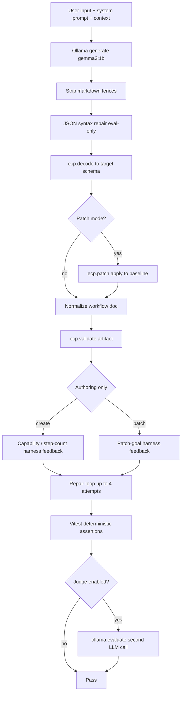

# Harness evaluation matrix — full test report

This document catalogs **every assertion and eval case** in the `@executioncontrolprotocol/evals` harness matrix, how validation works, and what we expect from `gemma3:1b` via Ollama. It is the companion reference to [harness-eval.md](./harness-eval.md) and [packages/evals/README.md](../packages/evals/README.md).

**Last aligned with:** 52 JSON matrix cases + supporting Vitest eval project tests (`npm run eval:harness`).

---

## Table of contents

1. [What we are testing](#what-we-are-testing)
2. [Validation layers](#validation-layers)
3. [Deterministic assertion reference](#deterministic-assertion-reference)
4. [LLM judge (`@executioncontrolprotocol/ollama.evaluate`)](#llm-judge-executioncontrolprotocolollamaevaluate)
5. [Harness invoke success (internal gates)](#harness-invoke-success-internal-gates)
6. [Runtime configuration](#runtime-configuration)
7. [Matrix cases by suite](#matrix-cases-by-suite)
8. [Multi-step flow cases](#multi-step-flow-cases)
9. [Other eval-project tests](#other-eval-project-tests)
10. [Fixture assets](#fixture-assets)

---

## What we are testing

| Category | Suite | Cases | Harness | Primary artifact |
| -------- | ----- | ----- | ------- | ---------------- |
| **Workflow create** | `workflow-create` | 12 | `@executioncontrolprotocol/evals-workflow-authoring` | `@executioncontrolprotocol.workflow` |
| **Workflow patch** | `workflow-patch` | 12 | `@executioncontrolprotocol/evals-workflow-authoring` | `@executioncontrolprotocol.patch` → patched `@executioncontrolprotocol.workflow` |
| **Intent routing** | `intent` | 12 | `@executioncontrolprotocol/evals-intent-classification` | `@executioncontrolprotocol.intent` |
| **Run-aware Q&A** | `assistant` | 10 | `@executioncontrolprotocol/evals-workflow-assistant` | `@executioncontrolprotocol.harness.reply` |
| **End-to-end flows** | `flow` | 6 | Mixed (intent → authoring → assistant) | Per step |

**Model under test:** `gemma3:1b` (`OLLAMA_GEMMA_1B_EVAL`), base URL `http://localhost:11434`, `num_ctx: 8192`.

**Matrix environment extensions (binding order):** `@executioncontrolprotocol/format-toon`, `@executioncontrolprotocol/format-json`, `@executioncontrolprotocol/test`, `@executioncontrolprotocol/demo`.

Cases are defined in [`packages/evals/fixtures/cases/*.cases.json`](../packages/evals/fixtures/cases/). Vitest loads them via `loadEvalCases()` and `runEvalCase()` — no per-case test files.

---

## Validation layers

Each matrix case passes through these layers **in order**. A failure at any layer fails the test (unless only the judge is enabled with `judge.only: true`, which none of our cases use).



| Layer | Where | Fail-closed? | Notes |
| ----- | ----- | ------------ | ----- |
| **Harness invoke** | Eval harness handlers | Yes | `invokeSuccess` requires `ecp.invoke(...).process()` `success: true` |
| **Decode** | `@executioncontrolprotocol/format-json` | Yes | Invalid JSON / wrong schema → repair prompt |
| **Patch apply** | `ecp.patch` | Yes | Invalid paths, missing steps |
| **Schema validation** | `ecp.validate` | Yes | ECP workflow / intent / reply rules |
| **Harness goal checks** | `request-capability-hints.ts` | Yes | Missing steps, wrong labels, patch goals |
| **Deterministic assertions** | `assertions.ts` | Yes | Exact field checks in Vitest |
| **LLM judge** | `@executioncontrolprotocol/ollama.evaluate` | Yes on errors; lenient on judge parse failure | See [judge section](#llm-judge-executioncontrolprotocolollamaevaluate) |

**Repair loop:** `HARNESS_NANO_REPAIR` sets `maxAttempts: 3`, and handlers use `1 + maxAttempts` → **up to 4 model calls** per case. Failed attempts append structured repair text (`formatStructuredRepairForModel`) plus fixture `repairHint` from `@executioncontrolprotocol/core` harness prompts.

**Eval-only JSON repair** (before decode): `repairWorkflowJsonSyntax` / `repairPatchJsonSyntax` in `@executioncontrolprotocol/evals` — hoists nested `steps`, fixes floating `"as"`, strips stray `)` / `"`, etc. These are **not** production browser behavior; they measure 1B output quality under a forgiving pre-decode pass.

---

## Deterministic assertion reference

Every `deterministic` entry in case JSON maps to [`assertDeterministic()`](../packages/evals/src/fixtures/assertions.ts). Unless `invokeSuccess` is omitted, the runner **auto-injects** `invokeSuccess` as the first check.

| Assertion kind | Validates | Pass condition |
| -------------- | --------- | -------------- |
| **`invokeSuccess`** | Full harness pipeline | `ecp.invoke` result `success === true` (decode, validate, patch, harness feedback). On failure, Vitest message includes diagnostics and up to 500 chars of `rawModelOutput`. |
| **`artifactSchema`** | Top-level `artifact.schema` | Exact string match (e.g. `@executioncontrolprotocol.workflow`) |
| **`validationValid`** | `artifact.validation` from harness | `validation.valid === true` (or absent → treated as true) |
| **`intent`** | Intent document | `schema === @executioncontrolprotocol.intent` and `intent` equals expected enum: `faq`, `workflow-create`, `workflow-patch`, `general` |
| **`replySchema`** | Assistant reply | `schema === @executioncontrolprotocol.harness.reply` |
| **`stepUses`** | Workflow steps | Some step has `uses === capabilityId` (any step shape with `uses`, not only `type: "step"`) |
| **`stepCount`** | Workflow `steps.length` | `exact` if set, else `min` (default 1) |
| **`stepLabel`** | One step’s `label` | `steps[stepId].label === value` |
| **`stepRemoved`** | Patch outcome | No step with `id === stepId` |
| **`inputRefPresent`** | Step chaining | Step `input` contains a nested object with `$ref` |
| **`citationStepId`** | Assistant citations | Citation `{ kind: "step", id }` **or** `answer` contains step id substring |
| **`answerContains`** | Assistant answer text | Case-insensitive substring in `answer` |
| **`descriptorListsExtensions`** | Environment describe | Each listed extension id appears in `ecp.describe().extensions` (matrix uses pinned `MATRIX_EVAL_EXTENSION_IDS`) |
| **`descriptorListsCapabilities`** | Environment describe | Each capability id appears in `ecp.describe().capabilities` |

**Not asserted by matrix JSON (but enforced inside harness invoke):**

- Patch documents must decode to `@executioncontrolprotocol.patch` and apply cleanly.
- Create output must include all capabilities inferred from the request (`inferRequiredCapabilityIds`).
- Patch add/remove must preserve baseline steps when harness feedback runs.

---

## LLM judge (`@executioncontrolprotocol/ollama.evaluate`)

When `judge.enabled: true` and `requireApproved: true`, after deterministic checks pass, [`assertJudge()`](../packages/evals/src/fixtures/assertions.ts) invokes `@executioncontrolprotocol/ollama.evaluate` with:

| Field | Source |
| ----- | ------ |
| `goal` | Case `judge.goal`, or default `"Eval case {id}"` |
| `criteria` | Case `judge.rubric`, or default *(see below)* |
| `artifact` | Full harness artifact (for workflows, entire workflow JSON is stringified if there is no `answer` field) |

**Judge prompt** ([`packages/extensions/ollama/src/index.ts`](../packages/extensions/ollama/src/index.ts)):

- System: *"Approve (approved true) when the answer satisfies the goal and rubric; otherwise approved false."*
- User: JSON-only `{"approved":true,"feedback":"ok"}` or `{"approved":false,"feedback":"reason"}`
- Includes `Goal`, `Rubric`, and `Answer` (first 1500 chars of answer or stringified artifact)

**Default rubric** when `rubric` is omitted: `"Accurate, on-topic, and actionable."`

**Fail-closed behavior:**

- Test **fails** if `requireApproved: true` and judge returns `approved: false`.
- Test **fails** if evaluate invoke throws or returns `success: false` (see `assert-judge.test.ts`).
- If judge output is **not parseable JSON**, evaluate returns `approved: true` with `"evaluation skipped"` — avoids false failures from judge formatting, not from model quality.

**Optional `judge.only`:** Skips deterministic assertions (unused in current fixtures).

---

## Harness invoke success (internal gates)

### Workflow authoring (`@executioncontrolprotocol/evals-workflow-authoring`)

| Mode | Input | Invoke succeeds when |
| ---- | ----- | -------------------- |
| **Create** | `{ request, model? }` | Single `@executioncontrolprotocol.workflow` JSON decodes; validates; every capability inferred from request appears in `steps[].uses`; no nested `workflow.steps`; repair loop exhausted otherwise |
| **Patch** | `{ request, manifest, model? }` | `@executioncontrolprotocol.patch` decodes; patch applies; result validates; patch-goal feedback satisfied (label, remove, add capabilities) |

**Prompt context (matrix):** plain-text capability list; **no** TOON-encoded descriptor (`includeEncodedDescriptor: false`). Optional capability hint lines and patch operation hints. Few-shots from `workflow-authoring-create.prompt.json` / `workflow-authoring-patch.prompt.json`.

### Intent classification (`@executioncontrolprotocol/evals-intent-classification`)

| Input | Invoke succeeds when |
| ----- | -------------------- |
| `{ message, model? }` | `@executioncontrolprotocol.intent` JSON decodes; validates; environment descriptor included in prompt (matrix config) |

### Workflow assistant (`@executioncontrolprotocol/evals-workflow-assistant`)

| Input | Invoke succeeds when |
| ----- | -------------------- |
| `{ message, runContext?, model? }` | `@executioncontrolprotocol.harness.reply` JSON decodes; validates; optional run/workflow digests in prompt |

---

## Runtime configuration

| Setting | Value |
| ------- | ----- |
| Profile | `ollama-gemma-1b` |
| Model | `gemma3:1b` |
| Base URL | `http://localhost:11434` |
| Context window | `8192` (`numCtx`) |
| Output format | `@executioncontrolprotocol/format-json` |
| Repair | enabled, `maxAttempts: 3` → **4** generate attempts max |
| Trace on failure | prompt, rawOutput, validation (when enabled in config) |

---

## Matrix cases by suite

### Suite: `workflow-create` (12 cases)

Harness: **workflow-authoring** (create). Model: **default** → `gemma3:1b`.

| ID | Title | User request (summary) | Deterministic expectations | Judge |
| -- | ----- | ---------------------- | -------------------------- | ----- |
| **wf-create-01** | Minimal echo | Create minimal `@executioncontrolprotocol.workflow` with one echo step, input `hello` | `invokeSuccess`; `artifactSchema` `@executioncontrolprotocol.workflow`; `validationValid`; extensions `@executioncontrolprotocol/format-toon`, `@executioncontrolprotocol/format-json`, `@executioncontrolprotocol/test`, `@executioncontrolprotocol/demo`; `stepUses` `@executioncontrolprotocol/test.echo`; `stepCount` **exact 1** | Off |
| **wf-create-02** | Echo plus summarize | Echo then summarize, passing echo output | Same extension list; `stepCount` **min 2**; `stepUses` `@executioncontrolprotocol/demo.summarize` | Off |
| **wf-create-03** | Validate then echo | Build workflow: first `@executioncontrolprotocol/demo.validate` then `@executioncontrolprotocol/test.echo` | `stepUses` `@executioncontrolprotocol/demo.validate` | Off |
| **wf-create-04** | Notify step | Echo + final `@executioncontrolprotocol/demo.notify` | `stepUses` `@executioncontrolprotocol/demo.notify` | Off |
| **wf-create-05** | Translate branch | Two-step echo + `@executioncontrolprotocol/demo.translate` | `stepUses` `@executioncontrolprotocol/demo.translate` | Off |
| **wf-create-06** | Spanish label | Spanish: one echo step | `stepUses` `@executioncontrolprotocol/test.echo` | Off |
| **wf-create-07** | French label | French: one echo step | `stepUses` `@executioncontrolprotocol/test.echo` | Off |
| **wf-create-08** | German label | German: one echo step | `stepUses` `@executioncontrolprotocol/test.echo` | Off |
| **wf-create-09** | Triple steps | 3-step: validate, echo, summarize | `stepCount` **min 3** | Off |
| **wf-create-10** | Workflow id minimal-echo | Workflow id `minimal-echo`, one echo labeled Runner | `stepUses` `@executioncontrolprotocol/test.echo` | Off |
| **wf-create-11** | Quality judge | Production-style echo ingestion workflow | `invokeSuccess`; schema + validation + extensions (no step-specific asserts) | **On** — Goal: *"Workflow is coherent and references echo capability"*; `requireApproved: true`; default rubric |
| **wf-create-12** | Descriptor caps | List capabilities then echo-only workflow | `descriptorListsCapabilities` `@executioncontrolprotocol/test.echo`, `@executioncontrolprotocol/demo.summarize` | Off |

**Implicit create expectations (harness, all rows):** Top-level `steps` array; `input` not `inputs`; `uses` must be real capability ids from environment; multi-capability requests must produce one step per required capability (enforced via repair feedback).

---

### Suite: `workflow-patch` (12 cases)

Harness: **workflow-authoring** (patch). Baseline from `baselineWorkflow` fixture.

| ID | Title | Baseline | User request (summary) | Deterministic expectations | Judge |
| -- | ----- | -------- | ---------------------- | -------------------------- | ----- |
| **wf-patch-01** | Label change | `echo-workflow.json` | Change echo label to **Patched Echo** | `stepLabel` echo → `"Patched Echo"` | Off |
| **wf-patch-02** | Input value | `echo-workflow.json` | Set echo input value to **world** | schema + validation only | Off |
| **wf-patch-03** | Add summarize | `echo-workflow.json` | Add summarize after echo (`@executioncontrolprotocol/demo.summarize`) | `stepCount` **min 2** | Off |
| **wf-patch-04** | Remove notify | `multi-cap-workflow.json` | Remove notify step | `stepRemoved` **notify** | Off |
| **wf-patch-05** | Workflow label | `two-step-chain.json` | Change workflow label to **Updated Chain** | schema + validation | Off |
| **wf-patch-06** | Step config | `two-step-chain.json` | Summarize label → **Short Summary** | `stepLabel` summarize → `"Short Summary"` | Off |
| **wf-patch-07** | Ref chain | `two-step-chain.json` | Summarize input must `$ref` echo output | `inputRefPresent` **summarize** | Off |
| **wf-patch-08** | Add validate | `echo-workflow.json` | Insert validate before echo | `stepUses` `@executioncontrolprotocol/demo.validate` | Off |
| **wf-patch-09** | Combined | `two-step-chain.json` | Add translate after echo; remove summarize if present | schema + validation | Off |
| **wf-patch-10** | Patch judge | `echo-workflow.json` | Improve echo label (user-friendly) | schema + validation | **On** — Goal: *"Patch is minimal and correct"*; `requireApproved: true` |
| **wf-patch-11** | Translate label | `echo-workflow.json` | Rename echo label to **Translated Output** | schema + validation | Off |
| **wf-patch-12** | Notify payload | `multi-cap-workflow.json` | Update notify to run after echo | schema + validation | Off |

**Patch patterns we teach (few-shots + hints):**

- Single-field edit: `steps[stepId].field` with `mode: "replace"`.
- Add/remove step: `path: "steps"`, `mode: "replace"`, full steps array (keep existing + add/remove).

---

### Suite: `intent` (12 cases)

Harness: **intent-classification**. Input: `{ message }`.

| ID | Title | Message (summary) | Expected `intent` | Extensions check | Judge (`requireApproved`) |
| -- | ----- | ----------------- | ----------------- | ---------------- | ------------------------- |
| **intent-01** | Salutation | Hello there! | `general` | 4 matrix extensions | Off |
| **intent-02** | FAQ | What is ECP? | `faq` | 4 extensions | Off |
| **intent-03** | Create | New workflow, summary email | `workflow-create` | 4 extensions | **On** — *"Intent should be workflow-create"* |
| **intent-04** | Patch | Update echo input to world | `workflow-patch` | 4 extensions | Off |
| **intent-05** | Capabilities | What extensions are available? | `general` | 4 extensions | **On** — *"Intent should be general"* |
| **intent-06** | Error symptom | Workflow failed on echo | `workflow-patch` | 4 extensions | **On** — *"Intent should be workflow-patch"* |
| **intent-07** | Bonjour | Bonjour! | `general` | 4 extensions | Off |
| **intent-08** | Hola create | Spanish: new flow with echo | `workflow-create` | 4 extensions | **On** — *"Intent should be workflow-create"* |
| **intent-09** | General chat | Tell me a joke | `general` | 4 extensions | **On** — *"Intent should be general"* |
| **intent-10** | Patch config | Change summarize step configuration | `workflow-patch` | 4 extensions | Off |
| **intent-11** | FAQ how | How does workflow patching work? | `faq` | 4 extensions | **On** — *"Intent should be faq"* |
| **intent-12** | Build | Pipeline with echo and notify | `workflow-create` | 4 extensions | **On** — *"Intent should be workflow-create"* |

**Intent values:** `faq` | `workflow-create` | `workflow-patch` | `general` (see `@executioncontrolprotocol/types` `ECP_INTENT_VALUES`).

---

### Suite: `assistant` (10 cases)

Harness: **workflow-assistant**. Input: `{ message, runContextFixture? }`.

| ID | Title | Message | Run fixture | Deterministic | Judge |
| -- | ----- | ------- | ----------- | ------------- | ----- |
| **asst-01** | Failed echo | Why did step echo fail? | `failed-echo-step.json` | `replySchema`; `answerContains` **echo** | **On** — Goal: *"Failed echo"* |
| **asst-02** | Failed status | What is the run status? | failed echo | `answerContains` **fail** | Off |
| **asst-03** | Running | Is workflow still running? | `running-pending.json` | `answerContains` **start** | Off |
| **asst-04** | Extensions | What plugins/extensions? | — | `answerContains` **ecp** | **On** — *"Extensions"* |
| **asst-05** | Steps | What steps in the workflow? | failed echo | `replySchema` only | Off |
| **asst-06** | Fix suggest | How fix echo error? | failed echo | `citationStepId` **echo** | **On** — *"Fix suggest"* |
| **asst-07** | Output | What did echo produce? | `completed-with-refs.json` | `replySchema` | Off |
| **asst-08** | Tone judge | Explain failure politely | failed echo | `replySchema` | **On** — Goal: *"Professional helpful tone"*; Rubric: *"Accurate and actionable"* |
| **asst-09** | Confirm patch | Patch step echo input? | failed echo | `replySchema` | **On** — Goal: *"Confirm patch"*; Rubric: *"Answer discusses patching or updating the echo step input and references the failed run or step echo."* |
| **asst-10** | Capabilities list | List supported step capabilities | — | `answerContains` **test.echo** | **On** — *"Capabilities list"* |

---

## Multi-step flow cases

Suite: **`flow`** (6 cases). Each case is one Vitest `it` but **multiple harness invokes** in sequence. Step index appears in failure messages (`[flow-02 step 1]`).

### flow-01 — Troubleshoot then patch

| Step | Harness | Input | Assertions |
| ---- | ------- | ----- | ---------- |
| 0 | intent-classification | *"The workflow failed on echo, help me fix it."* | `intent` → `workflow-patch` |
| 1 | workflow-authoring | Patch: set echo input to **recovered**; `manifestRef`: `echo-workflow.json` | `validationValid` |
| 2 | workflow-assistant | *"Confirm the fix applies to step echo?"*; run: `failed-echo-step.json` | `replySchema`; judge **On** — *"Confirms echo step"* |

### flow-02 — Create routing

| Step | Harness | Input | Assertions |
| ---- | ------- | ----- | ---------- |
| 0 | intent-classification | *"I need a new workflow with echo and summarize."* | `intent` → `workflow-create` |
| 1 | workflow-authoring | *"Create echo then @executioncontrolprotocol/demo.summarize workflow."* | `artifactSchema` `@executioncontrolprotocol.workflow` |

Note: step 1 does **not** list `invokeSuccess` in JSON; runner still injects it.

### flow-03 — FAQ then general

| Step | Harness | Input | Assertions |
| ---- | ------- | ----- | ---------- |
| 0 | intent-classification | *"How does patching work?"* | `intent` → `faq` |
| 1 | intent-classification | *"Thanks!"* | `intent` → `general` |

### flow-04 — Patch chain refs

| Step | Harness | Input | Assertions |
| ---- | ------- | ----- | ---------- |
| 0 | workflow-authoring | Ensure summarize uses `$ref` to echo; `two-step-chain.json` | `inputRefPresent` **summarize** |
| 1 | workflow-assistant | *"Did the chain run complete?"*; run: `completed-with-refs.json` | `replySchema`; judge **On** — *"Mentions completed run"* |

### flow-05 — Salutation to create

| Step | Harness | Input | Assertions |
| ---- | ------- | ----- | ---------- |
| 0 | intent-classification | *"Hi!"* | `intent` → `general` |
| 1 | intent-classification | *"Actually create an echo workflow."* | `intent` → `workflow-create` |
| 2 | workflow-authoring | *"Create minimal @executioncontrolprotocol/test.echo workflow."* | `stepUses` `@executioncontrolprotocol/test.echo` |

### flow-06 — Error explain and patch

| Step | Harness | Input | Assertions |
| ---- | ------- | ----- | ---------- |
| 0 | workflow-assistant | *"What error occurred?"*; failed echo run | `answerContains` **error**; judge **On** — *"Describes echo failure"* |
| 1 | workflow-authoring | Fix echo input to **hello**; echo workflow | `validationValid` |
| 2 | workflow-assistant | *"Where should the fix be applied?"* | `citationStepId` **echo**; judge **On** — *"Points to echo step"* |

**Flow debugging note:** Failures at **step 0** are almost always intent harness invoke/decode failures, not run fixture loading (fixtures apply on later assistant steps).

---

## Other eval-project tests

Besides the **52** matrix `it.each` cases, `npm run eval:harness` runs additional Vitest files under `packages/evals/test/` (~40 unit/smoke tests). These do **not** read `*.cases.json` unless noted.

| File | Type | What it validates |
| ---- | ---- | ----------------- |
| `matrix-workflow-create.eval.test.ts` | Matrix | All `workflow-create` cases |
| `matrix-workflow-patch.eval.test.ts` | Matrix | All `workflow-patch` cases |
| `matrix-intent.eval.test.ts` | Matrix | All `intent` cases |
| `matrix-assistant.eval.test.ts` | Matrix | `assistant` + `flow` cases |
| `matrix-descriptor-order.eval.test.ts` | Matrix infra | Extension ids appear in matrix binding order |
| `eval-matrix-count.test.ts` | Matrix infra | ≥50 cases, 4 extensions, unique ids |
| `load-eval-cases.test.ts` | Fixtures | Exactly 52 cases; loader smoke |
| `workflow-authoring.eval.test.ts` | Smoke | Manual create + patch (not fixture rows) |
| `intent-classification.eval.test.ts` | Smoke | Extension binding + 2 intent messages |
| `workflow-authoring-demo.test.ts` | Demo provider | Deterministic stub provider (not Ollama) |
| `intent-classification-demo.test.ts` | Demo provider | Stub intent routing |
| `repair-workflow-json.test.ts` | Unit | JSON repair helpers |
| `request-capability-hints.test.ts` | Unit | Capability inference + patch feedback |
| `presentation.test.ts` | Unit | Repair echo detection |
| `normalize-workflow-output.test.ts` | Unit | Workflow normalization |
| `summarize-environment.test.ts` | Unit | Environment digest size/content |
| `assert-judge.test.ts` | Unit | Judge fail-closed semantics |

---

## Fixture assets

### Workflow baselines (`fixtures/workflows/`)

| File | Steps (ids / uses) | Used by |
| ---- | ------------------ | ------- |
| `echo-workflow.json` | echo → `@executioncontrolprotocol/test.echo` | wf-patch-01–03, 08, 10–11; flow-01, 06 |
| `two-step-chain.json` | echo → summarize (`$ref` echo output) | wf-patch-05–07, 09; flow-04 |
| `multi-cap-workflow.json` | echo, notify, … | wf-patch-04, 12 |

### Run context (`fixtures/runs/`)

| File | Scenario |
| ---- | -------- |
| `failed-echo-step.json` | Run **failed**; echo step error (empty input) |
| `running-pending.json` | Run in progress |
| `completed-with-refs.json` | Completed run with step outputs |

### Harness prompts (system + few-shots, not in case JSON)

| Fixture id | Role |
| ---------- | ---- |
| `intent-classification` | Intent routing + few-shots |
| `workflow-authoring-create` | Create workflows |
| `workflow-authoring-patch` | Patch documents |
| `workflow-assistant` | `@executioncontrolprotocol.harness.reply` Q&A |

Loaded from [`packages/core/fixtures/harness-prompts/`](../packages/core/fixtures/harness-prompts/) via `buildSystemPrompt()` / `buildRepairHint()`.

---

## Quick reference: judge-enabled matrix cases

| Case | Goal | Custom rubric |
| ---- | ---- | ------------- |
| wf-create-11 | Workflow is coherent and references echo capability | *(default)* |
| wf-patch-10 | Patch is minimal and correct | *(default)* |
| intent-03, 05, 06, 08, 09, 11, 12 | Intent should be … | *(default)* |
| asst-01, 04, 06, 08, 09, 10 | See assistant table | asst-08, asst-09 only |
| flow-01 step 2 | Confirms echo step | *(default)* |
| flow-04 step 1 | Mentions completed run | *(default)* |
| flow-06 steps 0, 2 | Describes echo failure / Points to echo step | *(default)* |

---

## Running and reading failures

```sh
ollama pull gemma3:1b
npm run eval:matrix    # matrix Vitest files only
npm run eval:harness   # full eval project (matrix + unit + smoke)
```

On failure, check Vitest output for `diagnostics`, `rawModelOutput` (truncated), and `validation` paths. Enable trace fields via `HARNESS_NANO_TRACE` in harness config for full prompt text in `HarnessInvokeResult.trace`.
